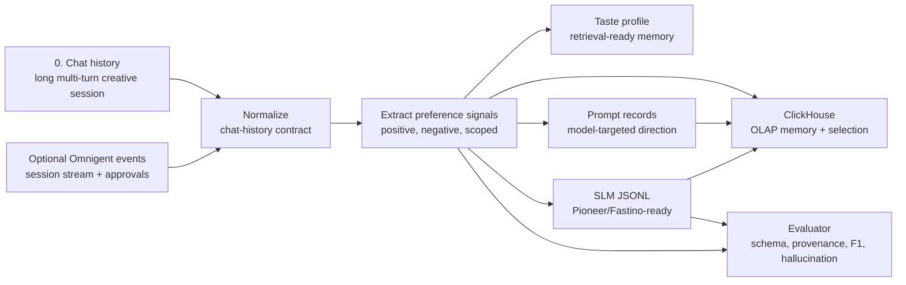
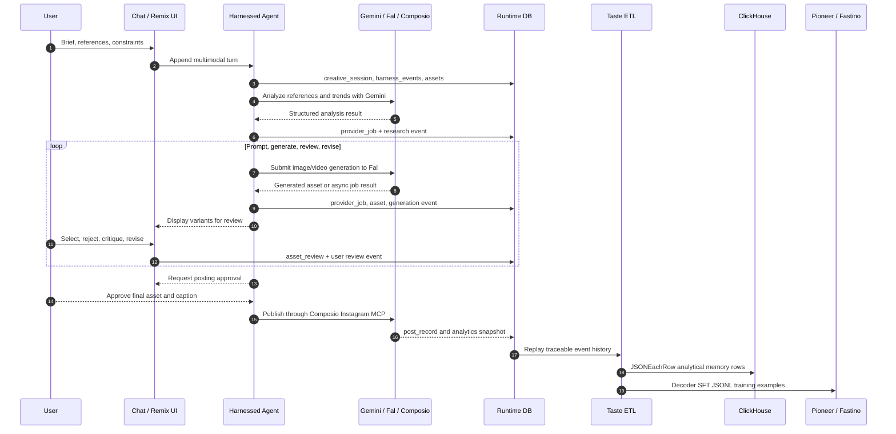
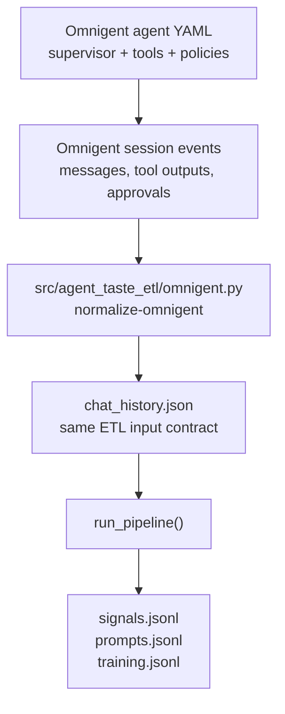

# Harness4Visuals ETL Follow-Up

This repo is a focused follow-up to the original `Harness4Visuals` prototype. It isolates the highest-leverage step in the harnessed agent workflow:

> Can an agent harness reliably transform messy chat history into faithful, provenance-backed taste memory and SLM training JSONL?

The goal is not to demo another provider call. The goal is to make the learning layer testable. If this step works, future remixing, prompting, generation, posting, and analytics can improve over time. If this step is wrong, the agent learns noisy or invented preferences.

## Visual Overview

The repo focuses on the learning layer inside a longer creative-agent workflow. The critical question is whether every long image/video iteration can become faithful taste memory and clean training data.



### Long Creative Session

Real image/video work is not a single prompt. It is a fire-wait-review loop where the user's strongest taste signals often appear after they compare generated options.



### Omnigent Abstraction Path

Omnigent can absorb repeated harness mechanics such as sessions, sub-agents, policies, and event streaming. Harness4Visuals still keeps the creative memory contract app-owned.



## What It Ships

- A deterministic ETL pipeline for chat history.
- Taste and brand preference extraction with source-turn provenance.
- Prompt records shaped for generation models.
- JSONL records suitable for downstream small language model fine-tuning.
- An evaluator that scores schema validity, provenance, precision, recall, F1, and hallucinated preference rate.
- A `verify` command that runs the full test loop against golden data.
- GitHub Actions CI that runs tests plus the verification loop.

## Quick Start

```bash
python -m pip install -e .
python -m unittest discover -s tests
python -m agent_taste_etl.cli verify --out out/verify
```

Run the ETL pipeline directly:

```bash
python -m agent_taste_etl.cli run \
  --input examples/chat_history.json \
  --out out/sample
```

Evaluate an output against the golden fixture:

```bash
python -m agent_taste_etl.cli evaluate \
  --predictions out/sample/signals.jsonl \
  --golden examples/golden_signals.jsonl
```

Export provider-ready integration artifacts:

```bash
python -m agent_taste_etl.cli export-clickhouse \
  --input examples/long_multiturn_chat_history.json \
  --out out/clickhouse

python -m agent_taste_etl.cli export-pioneer \
  --input examples/long_multiturn_chat_history.json \
  --out out/pioneer

python -m agent_taste_etl.cli normalize-omnigent \
  --input examples/omnigent_session_events.json \
  --out out/omnigent/chat_history.json
```

## Output Map

| Command | Reads | Writes | Purpose |
| --- | --- | --- | --- |
| `run` | `chat_history.json` | `signals.jsonl`, `taste_profile.json`, `prompts.jsonl`, `training.jsonl`, `manifest.json` | Produces the core memory and training artifacts. |
| `evaluate` | `signals.jsonl`, `golden_signals.jsonl` | metrics JSON on stdout | Scores schema validity, provenance, precision, recall, F1, and hallucination rate. |
| `verify` | fixture input and golden signals | full run output plus metrics | Runs the CI-grade proof loop. |
| `export-clickhouse` | `chat_history.json` | ClickHouse JSONEachRow files | Loads analytical memory, prompt, and training rows. |
| `export-pioneer` | `chat_history.json` | decoder SFT JSONL and training-job request | Prepares Pioneer/Fastino fine-tuning artifacts. |
| `normalize-omnigent` | Omnigent session events | `chat_history.json` | Converts generic harness events into the stable ETL input shape. |

## Harness Contract

The ETL step must produce records that are:

- **Faithful**: extracted from the chat, not inferred from nowhere.
- **Provenanced**: every preference points back to source turns and evidence.
- **Scoped**: durable brand taste is separated from campaign-only or session-only instructions.
- **Negative-aware**: dislikes and avoidances are first-class signals.
- **Model-ready**: training records are valid JSONL with stable metadata.
- **Replayable**: the same input produces the same output.

## Output Files

`run` writes:

- `signals.jsonl`: normalized preference records.
- `taste_profile.json`: grouped durable, campaign, and session preferences.
- `prompts.jsonl`: generation prompt records.
- `training.jsonl`: SLM fine-tuning examples.
- `manifest.json`: deterministic run metadata.

## Integration Guides

- [Full Harness4Visuals guide](docs/full-guide.md): harness manager, frontend shape, backend requests, provider adapters, runtime schema, and end-to-end workflow.
- [Omnigent harness abstraction](docs/integrations/omnigent.md): side-by-side custom harness versus Omnigent code shape, expected code reduction, and ETL adapter path.
- [ClickHouse integration](docs/integrations/clickhouse.md): analytical memory schema, JSONEachRow exports, loading commands, and query patterns.
- [Pioneer / Fastino integration](docs/integrations/pioneer-fastino.md): decoder SFT JSONL, dataset upload flow, training job request, and evaluation loop.
- [Training targets and alternatives](docs/integrations/training-targets.md): Hugging Face TRL, Together AI, and OpenAI-compatible fine-tuning guidance.

## Step Output Shapes

The harness is intentionally explicit about every intermediate shape. Each snippet below is shortened for readability, but the field names are the contract.

### 0. Chat History Input

Input should model a real creative session, not just a short user/assistant exchange. Image and video work usually moves through briefing, reference gathering, research, prompt drafts, async generation, review, revision, selection, and approval. The transcript needs to preserve that whole event trail.

Research basis:

- OpenAI's Responses API supports text and image inputs, stateful interactions, function calling, and built-in tools, which implies the history should preserve prior outputs and tool events, not only final chat text: [OpenAI Responses overview](https://developers.openai.com/api/reference/responses/overview/).
- Anthropic's vision docs describe image content blocks, URL/file references, and warn that resending base64 images in long multi-turn histories increases payload size and latency, so durable `asset_id` or file references are better for long sessions: [Claude vision docs](https://platform.claude.com/docs/en/build-with-claude/vision).
- Gemini's API reference calls out an Interactions API optimized for agentic workflows, server-side state, and complex multimodal multi-turn conversations, plus media generation endpoints for Imagen and Veo: [Gemini API reference](https://ai.google.dev/api).
- Tool-based agent loops need structured tool calls and tool results so the harness can replay what happened: [Claude tool use docs](https://platform.claude.com/docs/en/agents-and-tools/tool-use/overview).

The compact fixture at `examples/chat_history.json` is for unit tests. A more realistic long-session shape is in `examples/long_multiturn_chat_history.json`.

Top-level shape:

```json
{
  "conversation_id": "conv_h4v_launch_video_001",
  "objective": "Create a launch image carousel and short social video that matches the user's taste.",
  "created_at": "2026-06-15T09:00:00-07:00",
  "channels": ["instagram_reel", "instagram_carousel"],
  "messages": []
}
```

Each message is an event. `content` can stay a string for simple turns, or become typed content blocks when the turn contains references, selections, generated media, or tool artifacts.

```json
{
  "id": "turn_001",
  "role": "user",
  "phase": "brief",
  "timestamp": "2026-06-15T09:00:00-07:00",
  "content": [
    {
      "type": "text",
      "text": "I need a launch image and 8-second video. I want it to feel premium, kinetic, and founder-led. Avoid corporate explainer voice and AI-glossy faces."
    },
    {
      "type": "image_reference",
      "asset_id": "ref_mood_001",
      "uri": "asset://uploads/moodboard.png",
      "label": "moodboard",
      "notes": "High contrast, handheld camera energy, real workflow screens."
    }
  ],
  "metadata": {
    "surface": "chat",
    "user_intent": "creative_brief"
  }
}
```

Tool calls and tool results should be first-class events, because a real harness needs to replay provider behavior and long waits.

```json
{
  "id": "turn_006",
  "role": "assistant",
  "phase": "research",
  "content": [
    {
      "type": "text",
      "text": "I am going to analyze the references and extract reusable visual patterns before drafting prompts."
    }
  ],
  "tool_calls": [
    {
      "id": "call_trend_scan_001",
      "name": "gemini_analyze_social_reference",
      "status": "completed",
      "input": {
        "asset_ids": ["ref_mood_001", "ref_competitor_002"],
        "questions": ["What makes this feel current?", "What should we avoid copying?"]
      }
    }
  ]
}
```

Generated assets should be referenced by ID and URI, then reviewed in later user turns. Do not flatten them into one final prompt; preserve the revision trail.

```json
{
  "id": "turn_014",
  "role": "tool",
  "phase": "generation",
  "name": "fal_video_generate",
  "tool_call_id": "call_fal_video_001",
  "content": [
    {
      "type": "generated_asset",
      "asset_id": "gen_video_001",
      "modality": "video",
      "uri": "asset://generated/fal/gen_video_001.mp4",
      "model": "fal/veo-style-provider",
      "duration_seconds": 8,
      "status": "completed"
    }
  ]
}
```

User review turns are where the highest-value taste signals usually appear. The input shape should capture selection, comparison, negative feedback, and transient campaign constraints.

```json
{
  "id": "turn_015",
  "role": "user",
  "phase": "review",
  "content": [
    {
      "type": "text",
      "text": "Version B is closest. Keep the real workflow screens and fast cuts. Make it less corporate, avoid fake testimonials, and remove the glossy AI skin texture."
    },
    {
      "type": "selection",
      "selected_asset_ids": ["gen_video_001"],
      "rejected_asset_ids": ["gen_video_002"],
      "reason": "B has the right pacing, but the human shots still feel synthetic."
    }
  ]
}
```

A long conversation can contain dozens of turns. The ETL harness should keep enough structure to answer:

- What did the user ask for first?
- Which references and generated assets influenced the decision?
- Which tool calls produced which outputs?
- Which preferences are durable taste versus one-off campaign direction?
- What did the user approve, reject, or ask to revise?
- Which final prompt or training record came from which evidence?

Minimal valid text-only input still works:

```json
{
  "messages": [
    {
      "id": "turn_001",
      "role": "user",
      "timestamp": "2026-06-15T09:00:00-07:00",
      "content": "I want the content to feel energetic, polished, and creator-led. Avoid purple gradients and generic stock footage."
    }
  ]
}
```

Omnigent-managed sessions can be normalized into the same shape with:

```bash
python -m agent_taste_etl.cli normalize-omnigent \
  --input examples/omnigent_session_events.json \
  --out out/omnigent/chat_history.json
```

The adapter preserves Omnigent message, function-call output, and approval events as chat-history messages before the ETL pipeline extracts taste and training rows.

### 1. Normalized Chat Messages

The loader normalizes every message into the internal message shape. Missing IDs are filled as deterministic `turn_001`, `turn_002`, etc.

```json
{
  "id": "turn_001",
  "role": "user",
  "content": "I want the content to feel energetic, polished, and creator-led...",
  "timestamp": "2026-06-15T09:00:00-07:00"
}
```

### 2. Preference Signals

`signals.jsonl` contains one normalized preference per line. These records are the main memory artifact.

```json
{
  "id": "sig_0b9c8c5d8f42",
  "kind": "aesthetic",
  "subject": "purple gradients",
  "polarity": "negative",
  "scope": "durable",
  "confidence": 0.82,
  "weight": 0.9,
  "evidence": "Avoid purple gradients and generic stock footage.",
  "source_turn_ids": ["turn_001"]
}
```

Field meaning:

- `kind`: preference family, such as `aesthetic`, `voice`, `visual`, or `trust`.
- `subject`: the extracted taste object.
- `polarity`: `positive` or `negative`.
- `scope`: `durable`, `campaign`, or `session`.
- `confidence`: extraction confidence.
- `weight`: downstream influence strength.
- `evidence`: source text used to justify the signal.
- `source_turn_ids`: provenance back to the chat.

### 3. Taste Profile

`taste_profile.json` groups signals by memory scope for agent retrieval and UI display.

```json
{
  "durable": [
    {
      "id": "sig_0b9c8c5d8f42",
      "kind": "aesthetic",
      "subject": "purple gradients",
      "polarity": "negative",
      "confidence": 0.82,
      "weight": 0.9,
      "source_turn_ids": ["turn_001"]
    }
  ],
  "campaign": [],
  "session": []
}
```

### 4. Generation Prompt Records

`prompts.jsonl` turns preference memory into a model-targeted prompt record.

```json
{
  "id": "prompt_8be44716f3d0",
  "target": "social_generation_prompt",
  "prompt": "Generate a social content concept that reflects the user's durable taste. Lean into: energetic, polished, creator-led. Avoid: purple gradients, generic stock footage. Return a concise, model-ready prompt with visual direction, voice, and constraints.",
  "source_signal_ids": ["sig_123", "sig_456"]
}
```

### 5. SLM Training JSONL

`training.jsonl` is the natural fine-tuning shape for a small language model that learns this transformation.

```json
{
  "instruction": "Transform messy agent chat history into a faithful, provenance-backed social generation prompt for the user's taste profile.",
  "input": {
    "chat_summary": "I want the content to feel energetic, polished, and creator-led...",
    "taste_signals": [
      {
        "id": "sig_0b9c8c5d8f42",
        "kind": "aesthetic",
        "subject": "purple gradients",
        "polarity": "negative",
        "scope": "durable",
        "confidence": 0.82,
        "weight": 0.9,
        "evidence": "Avoid purple gradients and generic stock footage.",
        "source_turn_ids": ["turn_001"]
      }
    ]
  },
  "output": {
    "target": "social_generation_prompt",
    "prompt": "Generate a social content concept..."
  },
  "metadata": {
    "format": "slm_jsonl",
    "source": "chat_history",
    "source_turn_ids": ["turn_001"],
    "source_signal_ids": ["sig_0b9c8c5d8f42"]
  }
}
```

### 6. Run Manifest

`manifest.json` makes each run reproducible and easy to compare in CI.

```json
{
  "pipeline": "harness4visuals-etl-followup",
  "version": "0.1.0",
  "input_turns": 6,
  "signal_count": 15,
  "prompt_count": 1,
  "training_example_count": 1,
  "run_fingerprint": "054ee67e2090"
}
```

### 7. Evaluation Output

`evaluate` and `verify` emit a metrics object. `verify` fails if schema validity, provenance, F1, or hallucination thresholds fall outside the configured bounds.

```json
{
  "metrics": {
    "schema_validity_rate": 1.0,
    "provenance_rate": 1.0,
    "precision": 1.0,
    "recall": 1.0,
    "f1": 1.0,
    "hallucinated_preference_rate": 0.0,
    "true_positive": 15.0,
    "false_positive": 0.0,
    "false_negative": 0.0
  },
  "errors": []
}
```

## Why This Step

Video generation, posting, analytics, and UI display prove orchestration. This pipeline proves whether the harness can accumulate user taste over time without corrupting memory. It is the part most worth evaluating deeply because it decides whether the agent becomes more useful after each interaction.
