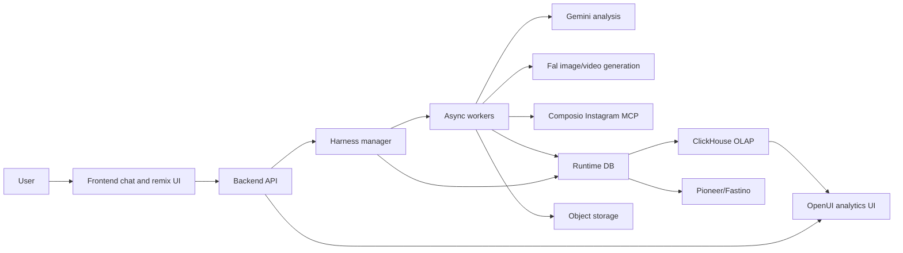

# Full Harness4Visuals Follow-Up Guide

This guide describes the complete product shape around the ETL harness:

- how the harnessed agent is managed
- what frontend code and state should look like
- what backend server requests should look like
- how provider adapters should be shaped
- how runtime and analytical database schemas fit together
- how long image/video iteration becomes training data

The repo implementation is intentionally small, but the contract below is the production target.

## External References

Use these provider docs as the source of truth when implementing real adapters:

- Gemini: [Gemini API docs](https://ai.google.dev/gemini-api/docs) and [Gemini API reference](https://ai.google.dev/api)
- Fal: [Fal client setup](https://fal.ai/docs/documentation/model-apis/inference/client-setup), [Fal queue API](https://fal.ai/docs/documentation/model-apis/inference/queue), [Fal JS client](https://fal.ai/docs/api-reference/client-libraries/javascript), and [Veo 3.1 model docs](https://fal.ai/models/fal-ai/veo3.1/api)
- Composio Instagram MCP: [Instagram toolkit](https://composio.dev/toolkits/instagram) and [Instagram MCP integration guide](https://composio.dev/toolkits/instagram/framework/autogen)
- OpenUI: [OpenUI introduction](https://www.openui.com/docs/openui-lang), [OpenUI dashboard architecture](https://www.openui.com/docs/openui-lang/examples/dashboard), and [LangChain OpenUI integration](https://docs.langchain.com/oss/python/langchain/frontend/integrations/openui)
- ClickHouse: [ClickHouse integration guide](./integrations/clickhouse.md)
- Pioneer/Fastino: [Pioneer/Fastino integration guide](./integrations/pioneer-fastino.md)

## System Map



## Harness Manager

The harness manager is the backend service that turns a chat into a durable workflow. It is not a single model call. It owns orchestration, state transitions, provider jobs, user approvals, provenance, and ETL.

### Responsibilities

- Keep the complete event log for the creative session.
- Maintain a session state machine.
- Convert user messages into tasks and provider calls.
- Preserve every reference asset, generated asset, review, and selection.
- Enforce human approval before posting.
- Normalize provider results into a single asset/job shape.
- Trigger ETL only from traceable event history.
- Export data to ClickHouse and Pioneer/Fastino.

### State Machine

```text
draft
  -> reference_ingest
  -> trend_analysis
  -> prompt_planning
  -> generation_submitted
  -> generation_waiting
  -> review_ready
  -> revision_requested
  -> generation_submitted
  -> approved
  -> posting_submitted
  -> posted
  -> analytics_ready
  -> etl_complete
  -> training_exported
```

Some transitions repeat. Real image/video work often has several generation/review loops before approval.

### Session Run Shape

```ts
type HarnessRun = {
  id: string;
  sessionId: string;
  userId: string;
  status:
    | "draft"
    | "reference_ingest"
    | "trend_analysis"
    | "prompt_planning"
    | "generation_submitted"
    | "generation_waiting"
    | "review_ready"
    | "revision_requested"
    | "approved"
    | "posting_submitted"
    | "posted"
    | "analytics_ready"
    | "etl_complete"
    | "training_exported"
    | "failed";
  currentPhase: string;
  iteration: number;
  activeProviderJobIds: string[];
  approvedAssetIds: string[];
  rejectedAssetIds: string[];
  createdAt: string;
  updatedAt: string;
};
```

### Event Log Shape

Every meaningful action becomes an event. The ETL pipeline should read from this log, not from a hand-built summary.

```ts
type HarnessEvent = {
  id: string;
  sessionId: string;
  turnId?: string;
  actor: "user" | "assistant" | "tool" | "system";
  phase:
    | "brief"
    | "reference_upload"
    | "research"
    | "prompt_draft"
    | "generation"
    | "review"
    | "revision_plan"
    | "approval"
    | "posting"
    | "analytics"
    | "etl";
  content: ContentBlock[];
  toolCalls?: ToolCallRecord[];
  providerJobIds?: string[];
  assetIds?: string[];
  metadata?: Record<string, unknown>;
  createdAt: string;
};
```

## Frontend Shape

The frontend should not be a simple chat transcript. It needs a creative workbench around the chat:

- conversation timeline
- reference tray
- prompt/remix panel
- provider job progress
- generated asset grid
- review and selection controls
- analytics dashboard after posting
- taste memory preview

### Recommended File Shape

```text
app/
  creative/[sessionId]/page.tsx
  api/
components/
  creative/
    CreativeSessionShell.tsx
    ConversationTimeline.tsx
    ReferenceTray.tsx
    RemixPanel.tsx
    GenerationQueue.tsx
    AssetGrid.tsx
    AssetReviewCard.tsx
    ApprovalBar.tsx
    AnalyticsPanel.tsx
    TasteMemoryPanel.tsx
lib/
  api/client.ts
  stream/session-events.ts
  types/harness.ts
```

### Frontend State

```ts
type CreativeSessionState = {
  session: CreativeSession;
  events: HarnessEvent[];
  assets: AssetRecord[];
  providerJobs: ProviderJob[];
  draftMessage: string;
  selectedAssetIds: string[];
  rejectedAssetIds: string[];
  tastePreview?: TasteProfile;
  analytics?: PostAnalyticsSnapshot;
  isStreaming: boolean;
};
```

### Content Blocks

Frontend component props can use camelCase internally, but persisted/API content blocks should use snake_case so they can be replayed directly by the ETL loader:

```ts
type ContentBlock =
  | { type: "text"; text: string }
  | {
      type: "image_reference";
      asset_id: string;
      uri: string;
      label?: string;
      notes?: string;
    }
  | {
      type: "video_reference";
      asset_id: string;
      uri: string;
      label?: string;
      notes?: string;
    }
  | {
      type: "generated_asset";
      asset_id: string;
      modality: "image" | "video";
      uri: string;
      model: string;
      duration_seconds?: number;
      status: "queued" | "processing" | "completed" | "failed";
    }
  | {
      type: "selection";
      selected_asset_ids: string[];
      rejected_asset_ids?: string[];
      reason?: string;
    };
```

### UI Flow

1. User creates a session and uploads references.
2. Frontend sends user turn to `POST /api/sessions/:id/messages`.
3. Backend emits timeline events over SSE or WebSocket.
4. Reference tray shows uploaded assets.
5. Remix panel shows current prompt plan and editable constraints.
6. Generation queue shows provider job states.
7. Asset grid shows generated variants as they complete.
8. User selects/rejects assets with reasons.
9. Approval bar gates posting.
10. Analytics panel renders post results after publishing.

### Example React Query Shape

```ts
async function sendMessage(sessionId: string, blocks: ContentBlock[]) {
  const response = await fetch(`/api/sessions/${sessionId}/messages`, {
    method: "POST",
    headers: { "Content-Type": "application/json" },
    body: JSON.stringify({ content: blocks }),
  });

  if (!response.ok) {
    throw new Error("Failed to send message");
  }

  return response.json();
}
```

### Streaming Events

Use SSE or WebSocket for provider progress. Do not make users poll manually while a video generation is running.

```ts
type SessionStreamEvent =
  | { type: "event.created"; event: HarnessEvent }
  | { type: "job.updated"; job: ProviderJob }
  | { type: "asset.created"; asset: AssetRecord }
  | { type: "taste.preview.updated"; tasteProfile: TasteProfile }
  | { type: "error"; message: string; retryable: boolean };
```

## Backend Server Shape

The backend should expose stable endpoints around sessions, messages, provider jobs, reviews, approvals, and exports.

### Recommended File Shape

```text
src/
  app/
    api/
      sessions/
        route.ts
        [sessionId]/
          messages/route.ts
          generations/route.ts
          reviews/route.ts
          approve-post/route.ts
          etl/route.ts
          events/route.ts
      provider-jobs/[jobId]/route.ts
      training-exports/pioneer/route.ts
  server/
    harness/
      manager.ts
      state-machine.ts
      planner.ts
      provenance.ts
    adapters/
      gemini.ts
      fal.ts
      composio-instagram.ts
      openui.ts
      clickhouse.ts
      pioneer.ts
    repositories/
      sessions.ts
      events.ts
      assets.ts
      provider-jobs.ts
      reviews.ts
      posts.ts
      etl-runs.ts
    workers/
      analyze-reference.ts
      generate-media.ts
      publish-instagram.ts
      extract-memory.ts
```

### Endpoint Summary

```text
POST   /api/sessions
GET    /api/sessions/:sessionId
GET    /api/sessions/:sessionId/events
POST   /api/sessions/:sessionId/messages
POST   /api/sessions/:sessionId/generations
POST   /api/sessions/:sessionId/reviews
POST   /api/sessions/:sessionId/approve-post
POST   /api/sessions/:sessionId/etl
GET    /api/provider-jobs/:jobId
POST   /api/training-exports/pioneer
```

### Create Session

Request:

```json
{
  "objective": "Create a launch image carousel and short social video.",
  "channels": ["instagram_reel", "instagram_carousel"],
  "initial_taste_profile_id": "taste_user_123"
}
```

Response:

```json
{
  "session_id": "sess_123",
  "status": "draft",
  "event_stream_url": "/api/sessions/sess_123/events"
}
```

### Add Message

Request:

```json
{
  "content": [
    {
      "type": "text",
      "text": "Version B is close. Keep fast cuts, less corporate language, avoid fake testimonials."
    },
    {
      "type": "selection",
      "selected_asset_ids": ["gen_video_002"],
      "rejected_asset_ids": ["gen_video_001"],
      "reason": "B has better pacing."
    }
  ]
}
```

Response:

```json
{
  "turn_id": "turn_018",
  "session_id": "sess_123",
  "accepted": true,
  "next_state": "revision_requested"
}
```

### Submit Generation

The frontend can ask the backend to generate media from the current prompt plan:

```json
{
  "modality": "video",
  "provider": "fal",
  "model": "fal-ai/veo3.1",
  "prompt_id": "prompt_123",
  "input": {
    "prompt": "A premium founder-led launch video...",
    "duration_seconds": 8,
    "aspect_ratio": "9:16",
    "resolution": "1080p"
  }
}
```

Response:

```json
{
  "provider_job_id": "job_123",
  "provider": "fal",
  "status": "queued",
  "request_id": "fal_request_abc"
}
```

### Review Assets

```json
{
  "selected_asset_ids": ["gen_image_001", "gen_video_002"],
  "rejected_asset_ids": ["gen_video_001"],
  "review_text": "Keep the image. The second video is right. Do not store meme chaos as my normal brand preference.",
  "approval_status": "approved_for_post"
}
```

### Trigger ETL

```json
{
  "session_id": "sess_123",
  "include_provider_payloads": false,
  "exports": ["clickhouse", "pioneer"]
}
```

Response:

```json
{
  "etl_run_id": "etl_123",
  "signal_count": 22,
  "clickhouse_export": "out/clickhouse",
  "pioneer_export": "out/pioneer"
}
```

## Provider Adapter Contracts

Provider adapters must normalize external APIs into a small internal shape.

```ts
type ProviderJob = {
  id: string;
  provider: "gemini" | "fal" | "composio" | "openui" | "clickhouse" | "pioneer";
  providerRequestId?: string;
  kind:
    | "analysis"
    | "image_generation"
    | "video_generation"
    | "post_publish"
    | "analytics_fetch"
    | "etl_export"
    | "training_export";
  status: "queued" | "running" | "completed" | "failed" | "cancelled";
  inputJson: unknown;
  outputJson?: unknown;
  errorJson?: unknown;
  createdAt: string;
  updatedAt: string;
};
```

### Gemini Reference Analysis

Use Gemini for messy social post/video analysis and structured extraction. The adapter should accept text plus asset references, then return JSON that the harness can store as a tool event.

Request shape:

```ts
type GeminiAnalyzeRequest = {
  assetIds: string[];
  questions: string[];
  outputSchema: {
    trendPatterns: string[];
    reusableVisualMoves: string[];
    risks: string[];
    promptHints: string[];
  };
};
```

Normalized result:

```json
{
  "provider": "gemini",
  "kind": "analysis",
  "trend_patterns": ["fast hook framing", "founder POV", "caption-led pacing"],
  "reusable_visual_moves": ["real workflow screens", "high contrast closeups"],
  "risks": ["too much hype language", "generic SaaS b-roll"],
  "prompt_hints": ["make the first second sharper", "avoid synthetic skin texture"]
}
```

Implementation notes:

- Use structured output for anything that feeds the harness state machine.
- Keep media as file references or object-store URLs; do not inline large video bytes into the event log.
- Store the raw provider response separately if you need auditability.

### Fal Image/Video Generation

Fal is a long-running provider path. The backend must hide the API key and use queue semantics.

Fal docs describe queue states like `IN_QUEUE`, `IN_PROGRESS`, and `COMPLETED`, plus status checks, result retrieval, cancellation, streaming updates, and webhooks. Fal also notes that media URLs can expire, so copy final media to your own object storage if the user approves it.

Adapter shape:

```ts
type FalGenerateRequest = {
  model: string;
  modality: "image" | "video";
  prompt: string;
  aspectRatio: "9:16" | "16:9" | "4:5" | "1:1";
  durationSeconds?: number;
  resolution?: "720p" | "1080p";
  seed?: number;
  referenceAssetIds?: string[];
};
```

Server-side usage shape:

```ts
import { fal } from "@fal-ai/client";

export async function submitFalVideo(req: FalGenerateRequest) {
  const result = await fal.queue.submit(req.model, {
    input: {
      prompt: req.prompt,
      aspect_ratio: req.aspectRatio,
      duration: req.durationSeconds,
      resolution: req.resolution,
    },
  });

  return {
    provider: "fal",
    providerRequestId: result.request_id,
    status: "queued",
  };
}
```

Status mapper:

```ts
function mapFalStatus(status: string): ProviderJob["status"] {
  if (status === "IN_QUEUE") return "queued";
  if (status === "IN_PROGRESS") return "running";
  if (status === "COMPLETED") return "completed";
  return "failed";
}
```

### Composio Instagram MCP

Use Composio for authenticated Instagram actions: publish, schedule, fetch comments, fetch media, and retrieve analytics. Composio's Instagram toolkit uses OAuth2 and supports MCP/direct API access for posting and insights.

Adapter shape:

```ts
type InstagramPublishRequest = {
  sessionId: string;
  approvedAssetIds: string[];
  caption: string;
  channel: "feed" | "reel" | "carousel" | "story";
  scheduledAt?: string;
  humanApprovedBy: string;
};
```

Hard rule: posting requires approval.

```ts
if (!request.humanApprovedBy) {
  throw new Error("Instagram publishing requires explicit human approval");
}
```

Store Composio tool calls as provider jobs:

```json
{
  "provider": "composio",
  "kind": "post_publish",
  "status": "completed",
  "input_json": {
    "channel": "reel",
    "asset_ids": ["gen_video_002"],
    "caption": "..."
  },
  "output_json": {
    "instagram_media_id": "1789...",
    "permalink": "https://instagram.com/..."
  }
}
```

### OpenUI Analytics and Remix UI

Use OpenUI when the backend needs to render data-rich analytics or remix panels. OpenUI works by having a model generate openui-lang, then a frontend `Renderer` maps that declarative output to React components. The OpenUI dashboard example uses a shared tool registry, an MCP route for runtime tool execution, and a chat route for prompt generation.

Recommended shape:

```ts
type AnalyticsDashboardData = {
  postId: string;
  metrics: {
    impressions: number;
    reach: number;
    likes: number;
    comments: number;
    saves: number;
    shares: number;
    engagementRate: number;
  };
  topComments: Array<{ text: string; sentiment: "positive" | "neutral" | "negative" }>;
  suggestedTasteUpdates: PreferenceSignal[];
};
```

The model should generate UI from validated data, not query private providers directly from the browser. Tool execution stays server-side.

### ClickHouse Export

ClickHouse stores the analytical memory layer:

- ETL runs
- preference signals
- prompt records
- training examples

Use:

```bash
python -m agent_taste_etl.cli export-clickhouse \
  --input examples/long_multiturn_chat_history.json \
  --out out/clickhouse
```

See [ClickHouse integration](./integrations/clickhouse.md) and [ClickHouse schema](../schemas/clickhouse/harness4visuals.sql).

### Pioneer/Fastino Export

Pioneer/Fastino stores provider-clean decoder SFT data and runs LoRA training jobs.

Use:

```bash
python -m agent_taste_etl.cli export-pioneer \
  --input examples/long_multiturn_chat_history.json \
  --out out/pioneer
```

See [Pioneer/Fastino integration](./integrations/pioneer-fastino.md).

## Database Schema

Use two database layers:

1. Runtime database: operational state for the product.
2. ClickHouse: analytical memory and training-selection store.

### Runtime Database

The runtime schema is provided at [schemas/postgres/harness_runtime.sql](../schemas/postgres/harness_runtime.sql).

Core tables:

- `creative_sessions`: one creative workflow.
- `harness_events`: append-only event log.
- `assets`: uploaded references and generated media.
- `provider_jobs`: normalized external provider calls.
- `asset_reviews`: selections, rejections, and user feedback.
- `post_records`: Instagram publish records.
- `analytics_snapshots`: post analytics fetched after publishing.
- `etl_runs`: ETL execution records and exported artifact paths.

Use Postgres, Neon, Supabase, or any relational DB for this layer. The critical requirement is transactional writes around events, assets, and provider jobs.

### Analytical Database

ClickHouse schema is provided at [schemas/clickhouse/harness4visuals.sql](../schemas/clickhouse/harness4visuals.sql).

Use ClickHouse for:

- durable taste retrieval across sessions
- campaign-versus-durable analysis
- prompt acceptance metrics
- training row selection
- provider latency/cost dashboards

Do not store raw image/video bytes in ClickHouse. Store object storage URIs and normalized metadata.

## End-to-End Workflow

### 1. Brief

Frontend sends text and references.

Backend writes:

- `creative_sessions`
- `harness_events`
- `assets`

### 2. Research

Harness manager submits Gemini analysis job.

Backend writes:

- `provider_jobs` row with `kind = analysis`
- tool event with structured analysis

### 3. Prompt Planning

Harness manager builds generation prompt with:

- durable taste
- current campaign constraints
- provider-specific prompt guidance
- negative preferences

### 4. Generation

Harness manager submits Fal jobs for image/video.

Backend writes:

- `provider_jobs`
- `assets` with `status = queued`
- progress events as Fal queue state changes

### 5. Review

Frontend shows generated variants. User selects/rejects assets and gives feedback.

Backend writes:

- `asset_reviews`
- `harness_events`
- session status transition

### 6. Revision

Harness manager converts review feedback into a new prompt plan. Repeat generation/review until approval.

### 7. Posting

Only after approval, backend calls Composio Instagram MCP.

Backend writes:

- `post_records`
- publish provider job
- post URL/media ID

### 8. Analytics

Backend fetches Instagram analytics through Composio and renders dashboards through OpenUI-compatible data/tool shapes.

Backend writes:

- `analytics_snapshots`
- analytics events

### 9. ETL

Backend converts the complete event log into:

- `signals.jsonl`
- `taste_profile.json`
- `prompts.jsonl`
- `training.jsonl`
- `manifest.json`

### 10. Export

Backend exports:

- ClickHouse JSONEachRow files
- Pioneer decoder SFT JSONL
- Pioneer dataset upload request
- Pioneer training job request

## Guardrails

- Never post without explicit user approval.
- Never store provider API keys in frontend code.
- Never inline large image/video bytes in chat history.
- Preserve source turn IDs for every preference signal.
- Keep durable taste separate from campaign-only direction.
- Store negative preferences as first-class memory.
- Treat provider callbacks as untrusted until validated.
- Copy approved generated media to controlled object storage before provider URLs expire.
- Keep raw provider payloads out of SFT rows; use manifests and database provenance instead.

## Implementation Checklist

- [ ] Runtime DB schema applied.
- [ ] Object storage configured for uploads and generated media.
- [ ] Server-only provider secrets configured.
- [ ] Event log writes are append-only.
- [ ] SSE/WebSocket stream emits provider progress.
- [ ] Fal jobs can be resumed from request IDs.
- [ ] Gemini analysis returns structured JSON.
- [ ] Composio Instagram connection is authenticated per user/org.
- [ ] Posting requires approval record.
- [ ] Analytics snapshots are stored.
- [ ] ETL runs from persisted event history.
- [ ] ClickHouse export passes JSONEachRow parse.
- [ ] Pioneer export creates provider-clean `messages` rows.
- [ ] CI runs `verify` before exports are trusted.
