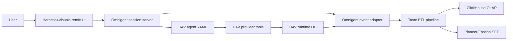

# Omnigent Harness Abstraction

This guide describes what changes if Harness4Visuals uses
[omnigent-ai/omnigent](https://github.com/omnigent-ai/omnigent) to abstract the repeated agent harness layer.

Omnigent is a meta-harness over Claude Code, Codex, Pi, and custom agents. Its public docs describe:

- agent sessions that can run from terminal, browser, phone, or a deployed server
- custom agents defined in YAML with prompts, executors, tools, sub-agents, OS access, terminals, and policies
- policy gates that can return `ALLOW`, `DENY`, or `ASK`
- a server/runner split where a FastAPI/WebSocket server coordinates sessions and a runner executes the LLM loop and tools on a host machine
- session event APIs such as `POST /v1/sessions/{session_id}/events` and elicitation approval events

The practical conclusion: Omnigent can reduce the custom harness shell, but it should not own the creative memory contract. Harness4Visuals still owns media schemas, review semantics, ETL validation, ClickHouse rows, and Pioneer/Fastino training records.

## Where It Fits



The recommended deployment is a hybrid:

1. Use Omnigent for session coordination, agent selection, sub-agent delegation, policy gating, shared live sessions, and event streaming.
2. Keep Harness4Visuals provider tools as typed Python or MCP tools called by the Omnigent agent.
3. Shadow-write Harness4Visuals runtime records from those tools, because media assets and provider jobs need stable application IDs.
4. Convert Omnigent session events into the existing ETL chat-history shape.
5. Run the same ClickHouse and Pioneer/Fastino exporters.

## Side-by-Side Functionality

These reductions are architecture estimates for this repo's intended production shape, not measured line counts from a full app implementation.

| Functionality | Current custom harness layer | Omnigent-based shape | Expected code reduction | What still stays app-owned |
| --- | --- | --- | --- | --- |
| Agent session lifecycle | Custom session creation, status polling, cancellation, reconnect, stream fan-out | Omnigent server plus runner/session APIs | 50-75% | Mapping session IDs to `creative_sessions` |
| Model and harness switching | Provider-specific model routing and environment wiring | `executor` in agent YAML plus CLI/session overrides | 40-65% | Which model is allowed for each creative phase |
| Sub-agent delegation | Custom supervisor plus worker queues | YAML `tools.<name>.type: agent`, `pass_history`, `max_sessions` | 60-80% | Creative role prompts and output contracts |
| Policy approvals | Bespoke approval queue for shell, posting, spend, provider access | Omnigent policies with `ALLOW`, `DENY`, `ASK`; session, agent, and server levels | 50-70% | Instagram publish policy wording and domain-specific approval UI |
| Tool registration | Hand-built tool router and JSON schema glue | YAML function tools and MCP tool declarations | 45-70% | Gemini/Fal/Composio/OpenUI payload shape and credentials |
| Browser/mobile session UI | Custom live chat/session monitor | Omnigent web UI can show live session state | 60-90% for generic session UI | Remix UI, asset gallery, comparisons, and analytics panels |
| Provider job tracking | Custom async status table, retries, provider payload storage | Omnigent can call tools and surface events, but provider job semantics remain custom | 10-30% | `provider_jobs`, asset URIs, cost/latency, retries, idempotency |
| ETL and training exports | App-specific extraction, provenance, JSONL, ClickHouse, Pioneer/Fastino | Reuse existing ETL after event normalization | 0-15% | Preference schema, evaluation, exporters, training examples |
| Database schema | H4V runtime and analytical schemas | Omnigent has its own session persistence; H4V should not couple to it directly | 0-20% | Operational media DB and OLAP/training schema |

## Code Shape: Custom Harness

A custom implementation tends to grow this surface:

```ts
class HarnessManager {
  async handleUserTurn(sessionId: string, turn: UserTurn) {
    await this.events.append({ sessionId, actor: "user", phase: "brief", content: turn.content });
    const references = await this.assets.ingest(turn.attachments);
    const analysis = await this.gemini.analyze({ sessionId, references });
    await this.events.appendToolResult(sessionId, "gemini_analyze_social_reference", analysis);

    const prompt = await this.promptPlanner.build({ sessionId, analysis });
    const job = await this.fal.submitVideo({ prompt });
    await this.providerJobs.insert(job);

    const asset = await this.fal.waitForResult(job.id);
    await this.assets.insert(asset);
    await this.events.append({ sessionId, actor: "tool", phase: "generation", assetIds: [asset.id] });
  }

  async requestInstagramPost(sessionId: string, assetId: string) {
    await this.approvals.requireHumanApproval(sessionId, "instagram_publish", { assetId });
    const result = await this.composio.instagramPublish({ assetId });
    await this.posts.insert(result);
  }
}
```

This code is not only provider logic. It also contains session routing, event fan-out, policy behavior, cancellation, and collaboration mechanics. Those are the repetitive parts Omnigent can absorb.

## Code Shape: Omnigent Agent

With Omnigent, the orchestration moves into an agent spec and typed tools:

```yaml
name: h4v_creative_supervisor
prompt: |
  You manage long-running image and video remix sessions.
  Preserve user taste, ask before posting, and keep every provider result traceable.

executor:
  harness: openai-agents

tools:
  gemini_analyze_social_reference:
    type: function
    description: Analyze references and trend examples for reusable visual patterns.
    callable: h4v_tools.gemini.analyze_social_reference
    parameters:
      type: object
      properties:
        session_id: { type: string }
        asset_ids:
          type: array
          items: { type: string }
      required: [session_id, asset_ids]

  fal_video_generate:
    type: function
    description: Submit an async video generation job and return normalized provider job metadata.
    callable: h4v_tools.fal.generate_video

  instagram_publish:
    type: function
    description: Publish an approved asset through Composio Instagram MCP.
    callable: h4v_tools.composio.instagram_publish

policies:
  instagram_approval:
    type: function
    handler: h4v_tools.policies.ask_before_instagram_publish

  session_budget:
    type: function
    handler: omnigent.policies.builtins.cost.cost_budget
    factory_params:
      max_cost_usd: 25.00
      ask_thresholds_usd: [10.00, 20.00]
```

The tool functions remain normal application code:

```python
def generate_video(session_id: str, prompt: str, duration_seconds: int = 8) -> dict:
    job = fal_client.submit(prompt=prompt, duration_seconds=duration_seconds)
    provider_job = {
        "provider": "fal",
        "kind": "video_generation",
        "external_job_id": job["request_id"],
        "status": "queued",
        "input_json": {"prompt": prompt, "duration_seconds": duration_seconds},
    }
    runtime_db.insert_provider_job(session_id, provider_job)
    return provider_job
```

And a posting approval policy can be expressed as a gate instead of a bespoke queue:

```python
def ask_before_instagram_publish(event: dict) -> dict | None:
    if event.get("type") != "tool_call":
        return None
    if event.get("data", {}).get("name") != "instagram_publish":
        return None
    return {
        "result": "ASK",
        "reason": "Approve this final asset and caption before Instagram publishing.",
    }
```

## What Is Reduced

Omnigent removes or shrinks code in these buckets:

- session attach, share, fork, reconnect, and cancellation mechanics
- generic web session view and event streaming
- tool registry boilerplate
- sub-agent launch and review wiring
- approval/policy plumbing
- model/harness routing across Codex, Claude Code, Pi, OpenAI-compatible gateways, and custom agents
- sandbox and host runner setup for code-executing agents

It does not remove:

- provider-specific request and response adapters
- media storage and thumbnail/proxy handling
- asset review semantics
- final prompt schema
- ClickHouse schema
- Pioneer/Fastino dataset shape
- evaluation thresholds
- privacy and retention policy for user taste memory

## ETL Feed

This repo now includes a concrete adapter:

- source: `src/agent_taste_etl/omnigent.py`
- fixture: `examples/omnigent_session_events.json`
- test: `tests/test_omnigent.py`
- CLI: `python -m agent_taste_etl.cli normalize-omnigent`

Run the conversion:

```bash
python -m agent_taste_etl.cli normalize-omnigent \
  --input examples/omnigent_session_events.json \
  --out out/omnigent/chat_history.json
```

Then run the existing ETL and exports:

```bash
python -m agent_taste_etl.cli run \
  --input out/omnigent/chat_history.json \
  --out out/omnigent/etl

python -m agent_taste_etl.cli export-clickhouse \
  --input out/omnigent/chat_history.json \
  --out out/omnigent/clickhouse

python -m agent_taste_etl.cli export-pioneer \
  --input out/omnigent/chat_history.json \
  --out out/omnigent/pioneer
```

### Event Mapping

| Omnigent event | Harness4Visuals normalized message | ETL effect |
| --- | --- | --- |
| `message` with `role=user` | `role=user`, content blocks normalized to text/reference/selection blocks | Source for durable, campaign, and session taste signals |
| `function_call_output` for Gemini | `role=tool`, `phase=research`, `tool_result` block | Preserved as provenance, not extracted as user taste |
| `function_call_output` for Fal | `role=tool`, `phase=generation`, generated asset/job payload | Connects later user review to generated media |
| `response.elicitation_request` | `role=system`, `phase=approval`, `approval_request` block | Preserves human approval gate without treating it as taste |
| `function_call_output` for Composio Instagram | `role=tool`, `phase=posting`, post payload | Connects final approval to publish result |
| analytics tool output | `role=tool`, `phase=analytics`, metrics payload | Can feed later memory updates if a user reacts to performance |

### Normalized Output Shape

```json
{
  "conversation_id": "conv_omnigent_h4v_001",
  "source": "omnigent_session_events",
  "messages": [
    {
      "id": "item_001",
      "role": "user",
      "phase": "brief",
      "content": [
        {
          "type": "text",
          "text": "My durable taste is still premium, kinetic, and founder-led..."
        }
      ],
      "metadata": {
        "source": "omnigent",
        "omnigent_event_type": "message",
        "session_id": "conv_omnigent_h4v_001"
      }
    }
  ]
}
```

The adapter intentionally converts to the existing chat-history contract instead of teaching the ETL pipeline about Omnigent internals. That keeps the training data stable if Omnigent changes an event field name.

## Database Impact

Use Omnigent's database for Omnigent sessions. Use the Harness4Visuals runtime database for product records.

Recommended runtime additions if this becomes a production app:

```sql
alter table creative_sessions
  add column external_harness text,
  add column external_session_id text;

create index if not exists idx_creative_sessions_external_harness
  on creative_sessions (external_harness, external_session_id);
```

Provider tools should still write:

- `provider_jobs` for Gemini, Fal, Composio, and analytics calls
- `assets` for uploaded references and generated image/video outputs
- `asset_reviews` for selected/rejected versions and user critique
- `post_records` for Instagram publish results
- `runtime_etl_runs` for ETL artifacts and exporter outputs

ClickHouse and Pioneer/Fastino do not need Omnigent-specific schemas. Add `external_harness = "omnigent"` to runtime metadata, then let the existing ETL generate the same analytical rows and training JSONL.

## Implementation Guidance

Use this boundary:

```text
Omnigent session events
  -> src/agent_taste_etl/omnigent.py
  -> chat_history.json
  -> load_chat_history()
  -> run_pipeline()
  -> ClickHouse JSONEachRow and Pioneer/Fastino decoder SFT
```

Do not couple training data directly to Omnigent's raw `conversation_items` table or OpenAPI response shape. Only the adapter should know that source format.

For long image/video iterations:

1. Keep every user critique turn as `role=user`.
2. Preserve generated asset IDs in selection blocks.
3. Keep provider tool outputs as `role=tool`.
4. Preserve approval events separately from user taste.
5. Only promote preferences from user turns or explicit user-approved memory edits.
6. Re-run ETL after every approved post, major revision, or analytics review.

## Risks and Caveats

- Omnigent is marked alpha in its public README, so pin and test the version before depending on event field details.
- A generic harness cannot know which media output is the best creative candidate. Harness4Visuals must still model selections, rejections, and final approvals.
- The adapter should be versioned because agent event streams change faster than analytical schemas.
- Posting policies should ask for approval even if the Omnigent session already has a broad tool-use policy. Instagram publishing is a domain action, not just a tool call.
- Cost controls should stack: Omnigent policy budgets for agent spend, plus Harness4Visuals provider-job budgets for Fal/Gemini/Composio calls.

## References

- [Omnigent README](https://github.com/omnigent-ai/omnigent)
- [Omnigent Agent YAML spec](https://github.com/omnigent-ai/omnigent/blob/main/docs/AGENT_YAML_SPEC.md)
- [Omnigent policies](https://github.com/omnigent-ai/omnigent/blob/main/docs/POLICIES.md)
- [Omnigent deploy and execution model](https://github.com/omnigent-ai/omnigent/blob/main/deploy/README.md)
- [Omnigent OpenAPI](https://raw.githubusercontent.com/omnigent-ai/omnigent/refs/heads/main/openapi.json)
